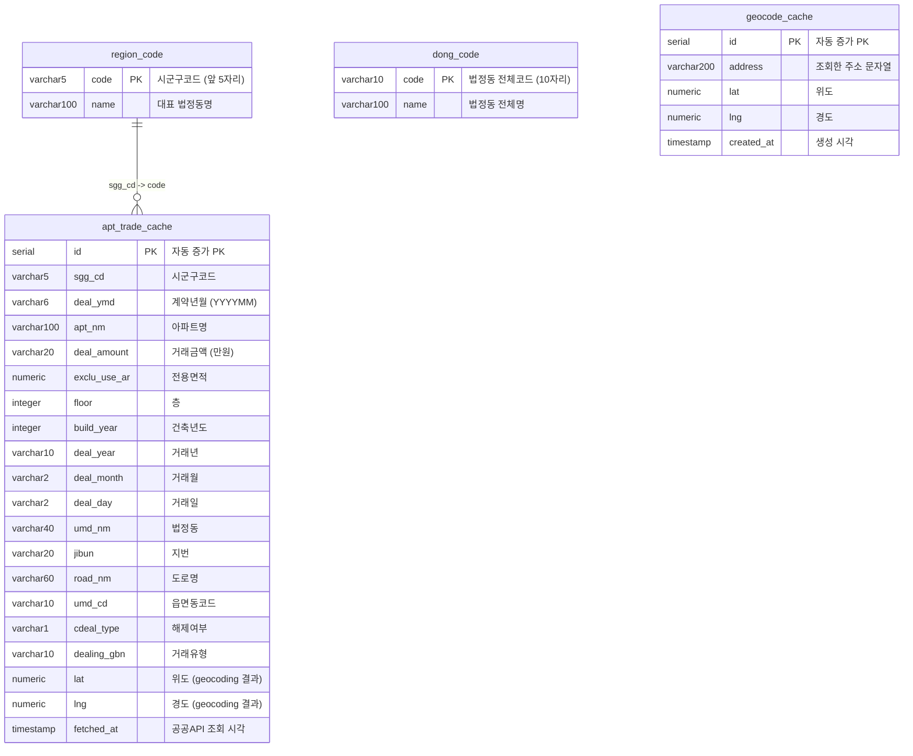

# DB 스키마

## 개요

PostgreSQL (Neon) 기반. 기존 테이블 2개(`dong_code`, `region_code`)를 그대로 활용하고, 공공API 응답 캐시용 테이블 1개(`apt_trade_cache`)와 geocoding 캐시용 테이블 1개(`geocode_cache`)를 추가한다.

Spring Boot의 `spring.sql.init` 기능으로 앱 시작 시 `schema.sql`을 자동 실행하여 신규 테이블을 생성한다. 기존 `dong_code`, `region_code`는 `scripts/init-db.js`(Node.js)로 별도 초기화한다.

---

## ERD



---

## 기존 테이블

### dong_code

법정동 전체 코드 목록. `scripts/init-db.js`로 초기화됨.

| 컬럼 | 타입 | 제약조건 | 설명 |
|------|------|---------|------|
| code | VARCHAR(10) | PRIMARY KEY | 법정동 전체코드 (10자리) |
| name | VARCHAR(100) | NOT NULL | 법정동 전체명 (예: "서울특별시 강남구 역삼동") |

### region_code

시군구 코드 (법정동코드 앞 5자리 그룹). `scripts/init-db.js`에서 `dong_code`로부터 생성됨.

| 컬럼 | 타입 | 제약조건 | 설명 |
|------|------|---------|------|
| code | VARCHAR(5) | PRIMARY KEY | 시군구코드 (앞 5자리) |
| name | VARCHAR(100) | NOT NULL | 대표 법정동명 (그룹 내 첫 번째) |

---

## 신규 테이블

### apt_trade_cache

공공데이터 포털 아파트 매매 실거래가 API 응답을 캐시하는 테이블. 시군구 코드 + 계약년월 단위로 저장하며, geocoding으로 획득한 좌표(lat, lng)도 함께 저장한다.

| 컬럼 | 타입 | 제약조건 | 설명 |
|------|------|---------|------|
| id | SERIAL | PRIMARY KEY | 자동 증가 PK |
| sgg_cd | VARCHAR(5) | NOT NULL | 시군구코드 (region_code.code 참조) |
| deal_ymd | VARCHAR(6) | NOT NULL | 조회 계약년월 (YYYYMM) |
| apt_nm | VARCHAR(100) | NOT NULL | 아파트명 |
| deal_amount | VARCHAR(20) | NOT NULL | 거래금액 (만원, 공백 포함 원본) |
| exclu_use_ar | NUMERIC(10,2) | | 전용면적 (m2) |
| floor | INTEGER | | 층 |
| build_year | INTEGER | | 건축년도 |
| deal_year | VARCHAR(4) | | 거래년 |
| deal_month | VARCHAR(2) | | 거래월 |
| deal_day | VARCHAR(2) | | 거래일 |
| umd_nm | VARCHAR(40) | | 법정동명 |
| jibun | VARCHAR(20) | | 지번 |
| road_nm | VARCHAR(60) | | 도로명 |
| umd_cd | VARCHAR(10) | | 읍면동코드 |
| cdeal_type | VARCHAR(1) | DEFAULT '' | 해제여부 (빈문자열=정상, "O"=해제) |
| dealing_gbn | VARCHAR(10) | | 거래유형 |
| lat | NUMERIC(10,7) | | 위도 (geocoding 결과, null 가능) |
| lng | NUMERIC(10,7) | | 경도 (geocoding 결과, null 가능) |
| fetched_at | TIMESTAMP | NOT NULL DEFAULT NOW() | 공공API에서 데이터를 가져온 시각 |

### geocode_cache

Kakao REST API geocoding 결과를 캐시하는 테이블. 같은 주소 문자열에 대한 중복 geocoding 호출을 방지한다.

| 컬럼 | 타입 | 제약조건 | 설명 |
|------|------|---------|------|
| id | SERIAL | PRIMARY KEY | 자동 증가 PK |
| address | VARCHAR(200) | NOT NULL, UNIQUE | 조회한 주소 문자열 (예: "서울특별시 강남구 역삼동 123-4") |
| lat | NUMERIC(10,7) | NOT NULL | 위도 |
| lng | NUMERIC(10,7) | NOT NULL | 경도 |
| created_at | TIMESTAMP | NOT NULL DEFAULT NOW() | 생성 시각 |

---

## schema.sql (Spring Boot 자동 실행)

Spring Boot의 `spring.sql.init.mode=always` 설정에 의해 앱 시작 시 `src/main/resources/schema.sql`이 자동 실행된다. `CREATE TABLE IF NOT EXISTS`로 멱등성을 보장한다.

```sql
-- apt_trade_cache: 공공API 실거래가 캐시
CREATE TABLE IF NOT EXISTS apt_trade_cache (
    id SERIAL PRIMARY KEY,
    sgg_cd VARCHAR(5) NOT NULL,
    deal_ymd VARCHAR(6) NOT NULL,
    apt_nm VARCHAR(100) NOT NULL,
    deal_amount VARCHAR(20) NOT NULL,
    exclu_use_ar NUMERIC(10,2),
    floor INTEGER,
    build_year INTEGER,
    deal_year VARCHAR(4),
    deal_month VARCHAR(2),
    deal_day VARCHAR(2),
    umd_nm VARCHAR(40),
    jibun VARCHAR(20),
    road_nm VARCHAR(60),
    umd_cd VARCHAR(10),
    cdeal_type VARCHAR(1) DEFAULT '',
    dealing_gbn VARCHAR(10),
    lat NUMERIC(10,7),
    lng NUMERIC(10,7),
    fetched_at TIMESTAMP NOT NULL DEFAULT NOW()
);

-- geocode_cache: Kakao geocoding 결과 캐시
CREATE TABLE IF NOT EXISTS geocode_cache (
    id SERIAL PRIMARY KEY,
    address VARCHAR(200) NOT NULL UNIQUE,
    lat NUMERIC(10,7) NOT NULL,
    lng NUMERIC(10,7) NOT NULL,
    created_at TIMESTAMP NOT NULL DEFAULT NOW()
);

-- 인덱스 (IF NOT EXISTS는 PostgreSQL 9.5+에서 지원)
CREATE INDEX IF NOT EXISTS idx_trade_sgg_ymd ON apt_trade_cache (sgg_cd, deal_ymd);
CREATE INDEX IF NOT EXISTS idx_trade_coords ON apt_trade_cache (lat, lng);
CREATE INDEX IF NOT EXISTS idx_trade_fetched ON apt_trade_cache (fetched_at);
```

---

## 인덱스 전략

| 테이블 | 인덱스명 | 컬럼 | 타입 | 용도 |
|--------|---------|------|------|------|
| apt_trade_cache | idx_trade_sgg_ymd | (sgg_cd, deal_ymd) | B-tree | 시군구+년월 단위 캐시 조회 (캐시 히트 판정) |
| apt_trade_cache | idx_trade_coords | (lat, lng) | B-tree | bounds 범위 필터링 WHERE 절 |
| apt_trade_cache | idx_trade_fetched | (fetched_at) | B-tree | 캐시 만료 판정 (현재 월 데이터 갱신 여부) |
| geocode_cache | (UNIQUE on address) | address | B-tree | 주소 중복 체크 + 조회 (UNIQUE 제약조건이 인덱스 역할) |

---

## MyBatis Mapper XML

### TradeCacheMapper.xml

`src/main/resources/mapper/TradeCacheMapper.xml`

```xml
<?xml version="1.0" encoding="UTF-8"?>
<!DOCTYPE mapper PUBLIC "-//mybatis.org//DTD Mapper 3.0//EN"
    "http://mybatis.org/dtd/mybatis-3-mapper.dtd">

<mapper namespace="com.mapapi.mapper.TradeCacheMapper">

    <!-- 캐시 히트 판정: 시군구+년월의 데이터 존재 여부 및 최종 조회 시각 확인 -->
    <select id="checkCacheStatus" resultType="map">
        SELECT COUNT(*) AS cnt, MAX(fetched_at) AS last_fetched
        FROM apt_trade_cache
        WHERE sgg_cd = #{sggCd} AND deal_ymd = #{dealYmd}
    </select>

    <!-- bounds 범위 내 거래 데이터 조회 -->
    <select id="findByBounds" resultType="com.mapapi.dto.TradeItem">
        SELECT apt_nm, deal_amount, lat, lng, exclu_use_ar, floor,
               deal_year, deal_month, deal_day, build_year,
               umd_nm, jibun, road_nm, sgg_cd, cdeal_type, dealing_gbn
        FROM apt_trade_cache
        WHERE sgg_cd IN
            <foreach item="code" collection="sggCodes" open="(" separator="," close=")">
                #{code}
            </foreach>
          AND deal_ymd = #{dealYmd}
          AND lat IS NOT NULL
          AND lng IS NOT NULL
          AND lat BETWEEN #{swLat} AND #{neLat}
          AND lng BETWEEN #{swLng} AND #{neLng}
        ORDER BY deal_year DESC, deal_month DESC, deal_day DESC
    </select>

    <!-- 거래 캐시 일괄 저장 -->
    <insert id="insertBatch">
        INSERT INTO apt_trade_cache (
            sgg_cd, deal_ymd, apt_nm, deal_amount, exclu_use_ar,
            floor, build_year, deal_year, deal_month, deal_day,
            umd_nm, jibun, road_nm, umd_cd, cdeal_type, dealing_gbn,
            lat, lng, fetched_at
        ) VALUES
        <foreach item="item" collection="items" separator=",">
            (
                #{item.sggCd}, #{item.dealYmd}, #{item.aptNm}, #{item.dealAmount},
                #{item.excluUseAr}, #{item.floor}, #{item.buildYear},
                #{item.dealYear}, #{item.dealMonth}, #{item.dealDay},
                #{item.umdNm}, #{item.jibun}, #{item.roadNm}, #{item.umdCd},
                #{item.cdealType}, #{item.dealingGbn},
                #{item.lat}, #{item.lng}, NOW()
            )
        </foreach>
    </insert>

    <!-- 캐시 갱신: 기존 데이터 삭제 (시군구+년월 단위) -->
    <delete id="deleteBySggCdAndDealYmd">
        DELETE FROM apt_trade_cache
        WHERE sgg_cd = #{sggCd} AND deal_ymd = #{dealYmd}
    </delete>

</mapper>
```

### TradeCacheMapper.java (인터페이스)

```java
@Mapper
public interface TradeCacheMapper {

    Map<String, Object> checkCacheStatus(@Param("sggCd") String sggCd,
                                          @Param("dealYmd") String dealYmd);

    List<TradeItem> findByBounds(@Param("sggCodes") List<String> sggCodes,
                                  @Param("dealYmd") String dealYmd,
                                  @Param("swLat") double swLat,
                                  @Param("neLat") double neLat,
                                  @Param("swLng") double swLng,
                                  @Param("neLng") double neLng);

    void insertBatch(@Param("items") List<TradeItem> items);

    void deleteBySggCdAndDealYmd(@Param("sggCd") String sggCd,
                                  @Param("dealYmd") String dealYmd);
}
```

### GeocodeCacheMapper.xml

`src/main/resources/mapper/GeocodeCacheMapper.xml`

```xml
<?xml version="1.0" encoding="UTF-8"?>
<!DOCTYPE mapper PUBLIC "-//mybatis.org//DTD Mapper 3.0//EN"
    "http://mybatis.org/dtd/mybatis-3-mapper.dtd">

<mapper namespace="com.mapapi.mapper.GeocodeCacheMapper">

    <!-- 주소로 좌표 조회 (캐시 히트) -->
    <select id="findByAddress" resultType="map">
        SELECT lat, lng
        FROM geocode_cache
        WHERE address = #{address}
    </select>

    <!-- geocoding 결과 저장 (중복 시 무시) -->
    <insert id="insertIfNotExists">
        INSERT INTO geocode_cache (address, lat, lng)
        VALUES (#{address}, #{lat}, #{lng})
        ON CONFLICT (address) DO NOTHING
    </insert>

    <!-- 여러 주소를 한번에 조회 (일괄 geocoding 최적화) -->
    <select id="findByAddresses" resultType="map">
        SELECT address, lat, lng
        FROM geocode_cache
        WHERE address IN
            <foreach item="addr" collection="addresses" open="(" separator="," close=")">
                #{addr}
            </foreach>
    </select>

</mapper>
```

### GeocodeCacheMapper.java (인터페이스)

```java
@Mapper
public interface GeocodeCacheMapper {

    Map<String, Object> findByAddress(@Param("address") String address);

    void insertIfNotExists(@Param("address") String address,
                            @Param("lat") double lat,
                            @Param("lng") double lng);

    List<Map<String, Object>> findByAddresses(@Param("addresses") List<String> addresses);
}
```

---

## 캐시 관리 전략

### 캐시 히트 판정 로직 (TradeService에서 구현)

```
1. TradeCacheMapper.checkCacheStatus(sggCd, dealYmd) 호출
2. 판정:
   - cnt = 0: 캐시 미스 -> 공공API 호출
   - cnt > 0 AND dealYmd가 현재 월 AND lastFetched < 오늘 00:00: 캐시 만료 -> 기존 삭제 후 재호출
   - cnt > 0 AND (dealYmd가 과거 월 OR lastFetched >= 오늘 00:00): 캐시 히트 -> DB에서 조회
```

### 캐시 갱신 플로우

```
1. TradeCacheMapper.deleteBySggCdAndDealYmd(sggCd, dealYmd) -- 기존 삭제
2. 공공API 호출 -> XML 파싱 -> TradeItem 리스트 생성
3. 각 TradeItem에 대해 GeocodeService로 좌표 획득
4. TradeCacheMapper.insertBatch(items) -- 일괄 저장
```

---

## 데이터 볼륨 예상

| 항목 | 수치 |
|------|------|
| region_code 레코드 수 | 약 250건 (전국 시군구) |
| dong_code 레코드 수 | 약 5,000건 (존재 상태 법정동) |
| 시군구당 월 거래 건수 | 약 100~500건 |
| apt_trade_cache (1개월) | 약 25,000~125,000건 (전국 기준) |
| geocode_cache | 점진 증가, 아파트 주소 단위 (전국 약 30,000~50,000건) |

MVP 단계에서는 현재 월 데이터만 캐시하므로, apt_trade_cache의 크기는 관리 가능한 수준이다.
